# Exploratory Data Analysis — Bank Customer Churn

## 1. Dataset Overview

**Source:** [Botswana Bank Customer Churn (Kaggle)](https://www.kaggle.com/datasets/sandiledesmondmfazi/bank-customer-churn)

- **Rows:** 115,640
- **Columns (raw):** 25
- **Columns (after cleaning):** 15
- **Missing values:** None
- **Duplicate rows:** None

### Columns Dropped

| Column | Reason |
|---|---|
| RowNumber, CustomerId | Row identifiers |
| Surname, First.Name | Personal identifiers |
| Date.of.Birth | Date field (could derive Age, but not used) |
| Address, Contact.Information | Free-text, not predictive |
| Occupation | 639 unique values — too high cardinality |
| Churn.Reason, Churn.Date | Post-churn leakage (only populated for churners) |

### Final Feature Set

| Feature | Type | Description |
|---|---|---|
| Gender | Categorical (2) | Female, Male |
| MaritalStatus | Categorical (3) | Divorced, Married, Single |
| NumDependents | Numeric (0–5) | Number of dependents |
| Income | Numeric | Annual income (5K–100K) |
| EducationLevel | Categorical (4) | Bachelor's, Diploma, High School, Master's |
| Tenure | Numeric (1–30) | Years as customer |
| CustomerSegment | Categorical (3) | Corporate, Retail, SME |
| CommChannel | Categorical (2) | Email, Phone |
| CreditScore | Numeric (300–850) | Credit score |
| CreditHistLength | Numeric (1–30) | Credit history length (years) |
| OutstandingLoans | Numeric | Outstanding loan amount |
| Balance | Numeric | Account balance |
| NumProducts | Numeric (1–5) | Number of bank products |
| NumComplaints | Numeric (0–10) | Number of complaints filed |
| **Churn** | **Target (0/1)** | **1 = churned, 0 = retained** |

---

## 2. Target Distribution

The dataset is **imbalanced**: ~88% retained vs ~12% churned.

| Churn | Count | Percentage |
|---|---|---|
| 0 (No Churn) | 101,546 | 87.81% |
| 1 (Churn) | 14,094 | 12.19% |

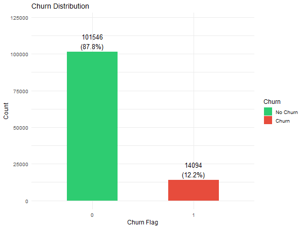

---

## 3. Categorical Features vs Churn

All categorical features show **virtually identical churn rates (~12.2%) across every level**. This means Gender, MaritalStatus, EducationLevel, CustomerSegment, and CommChannel have essentially no discriminative power for predicting churn.

| Feature | Levels | Churn Rate Range |
|---|---|---|
| Gender | Female, Male | 12.15%–12.23% |
| MaritalStatus | Divorced, Married, Single | 11.93%–12.47% |
| EducationLevel | 4 levels | 11.98%–12.33% |
| CustomerSegment | Corporate, Retail, SME | 12.10%–12.30% |
| CommChannel | Email, Phone | 12.19%–12.19% |

This is a consequence of the synthetic data generation — categorical features were sampled independently of churn.

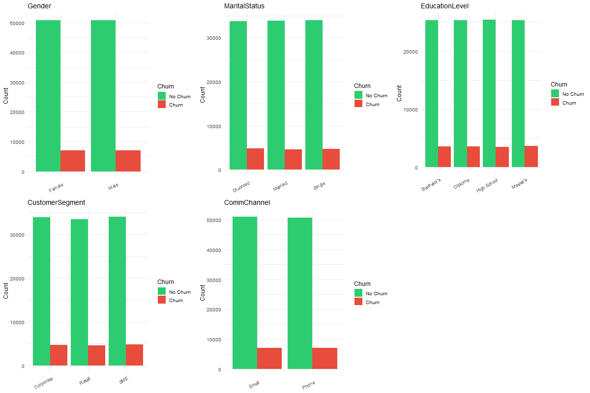

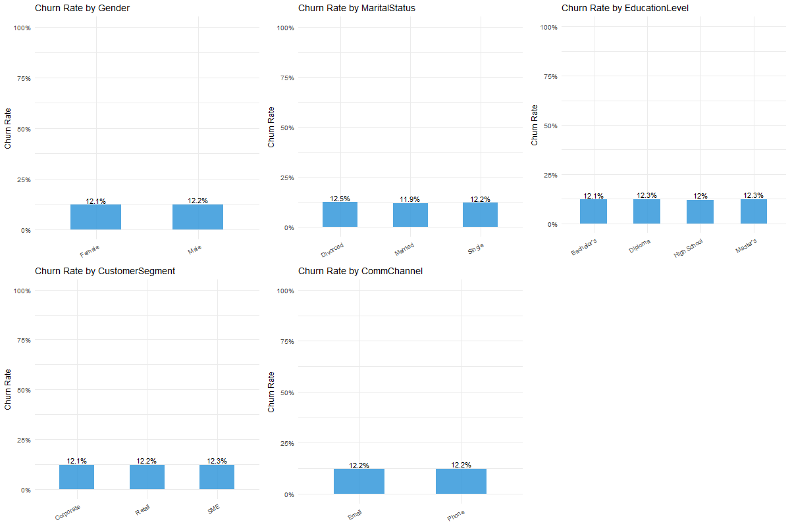

---

## 4. Numerical Feature Distributions

All numerical features have **near-perfect symmetry** (|skewness| < 0.02) and uniform-like distributions bounded within fixed ranges. No outliers were detected by IQR method.

This is consistent with synthetic data generated from uniform distributions.

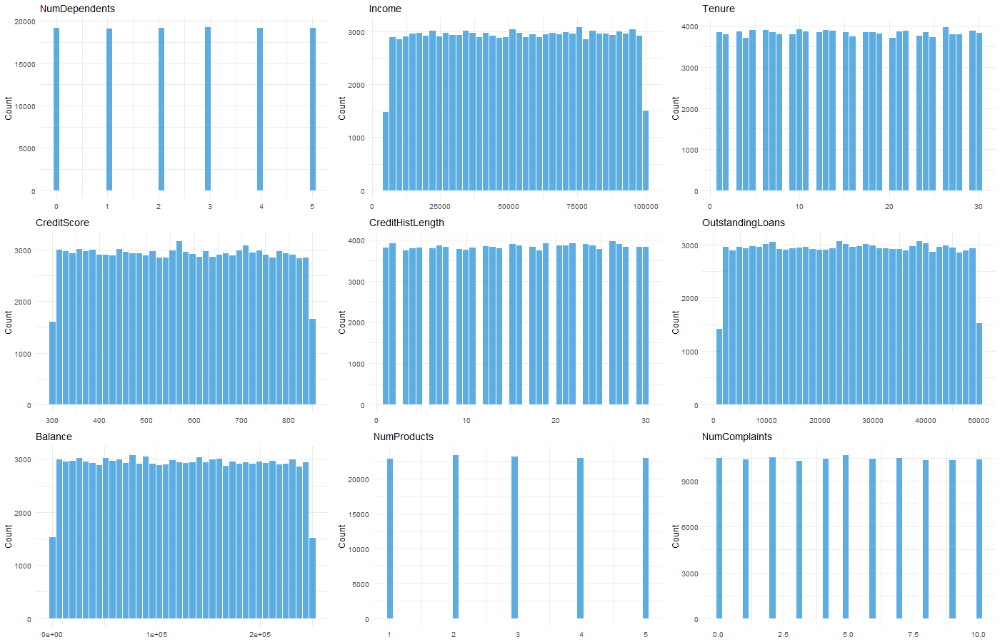

---

## 5. Features Correlated with Churn

The density and correlation analyses revealed which numerical features actually carry signal:

| Feature | Correlation with Churn | Interpretation |
|---|---|---|
| **Balance** | **−0.500** | Churners have drastically lower balances (~28K vs ~138K) |
| **NumComplaints** | **+0.205** | Churners file more complaints (avg 6.7 vs 4.8) |
| **CreditScore** | **−0.183** | Churners have lower credit scores (avg 496 vs 585) |
| **NumProducts** | **−0.179** | Churners use fewer products (avg 2.3 vs 3.1) |
| Income | +0.002 | No signal |
| Tenure | +0.000 | No signal |
| CreditHistLength | +0.003 | No signal |
| OutstandingLoans | −0.001 | No signal |
| NumDependents | +0.003 | No signal |

**Balance is by far the strongest predictor**, followed by NumComplaints, CreditScore, and NumProducts. The remaining features show no meaningful relationship with churn.

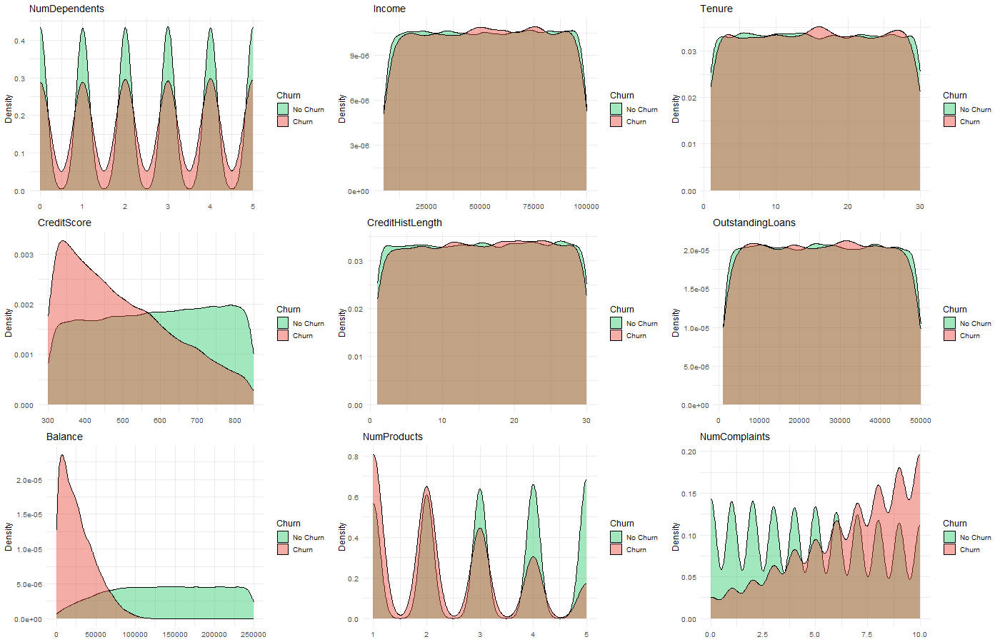

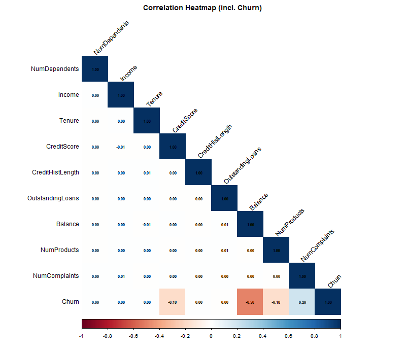

### Complaints vs Churn (monotonic relationship)

Churn rate increases monotonically with complaint count:

| Complaints | Churn Rate |
|---|---|
| 0 | 2.95% |
| 1 | 4.21% |
| 2 | 5.41% |
| 3 | 7.77% |
| 4 | 9.70% |
| 5 | 11.10% |
| 6 | 13.62% |
| 7 | 16.13% |
| 8 | 18.66% |
| 9 | 21.20% |
| 10 | 23.52% |

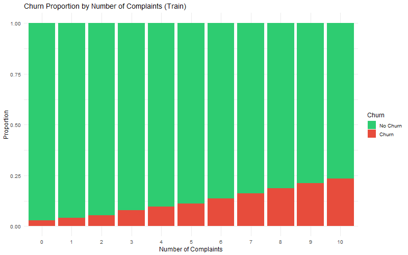

### Balance vs Churn

Churners cluster heavily in the low-balance range:

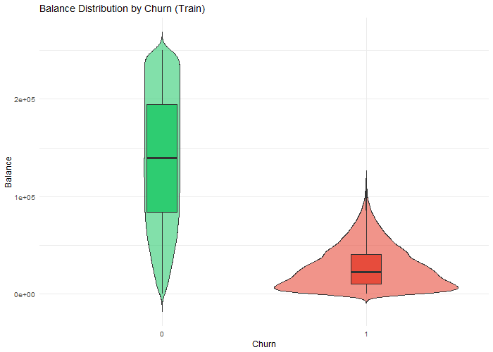

---

## 6. Train / Test Split

Stratified 80/20 split preserving churn ratio:

| Set | Rows | Churn % |
|---|---|---|
| Train | 92,513 | 12.19% |
| Test | 23,127 | 12.18% |

---

## 7. Training Set — Class Imbalance

**Imbalance ratio: 7.2 : 1** (81,237 retained vs 11,276 churned).

This will require handling during modeling (class weights, SMOTE, or stratified sampling).

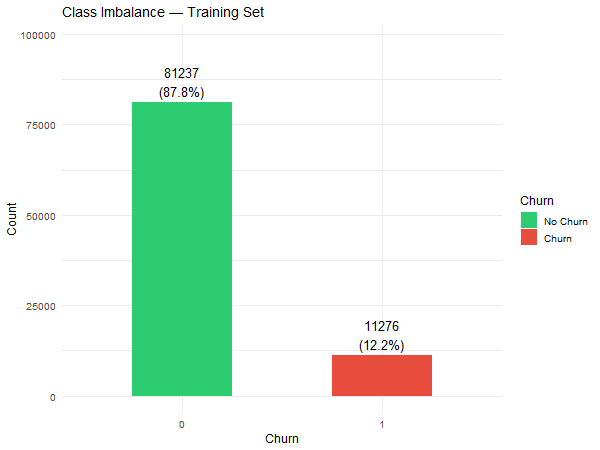

---

## 8. Training Set — Skewness & Outliers

### Skewness

All features have skewness extremely close to zero:

| Feature | Skewness | Kurtosis | Status |
|---|---|---|---|
| NumDependents | −0.0002 | −1.2682 | OK |
| Income | −0.0033 | −1.2016 | OK |
| Tenure | 0.0043 | −1.2026 | OK |
| CreditScore | 0.0010 | −1.2031 | OK |
| CreditHistLength | −0.0105 | −1.2014 | OK |
| OutstandingLoans | −0.0031 | −1.1969 | OK |
| Balance | 0.0077 | −1.1992 | OK |
| NumProducts | 0.0019 | −1.2946 | OK |
| NumComplaints | 0.0040 | −1.2160 | OK |

**No skewness corrections were applied.** All features are already near-perfectly symmetric. The negative kurtosis (~−1.2) confirms uniform-like distributions, consistent with synthetic data.

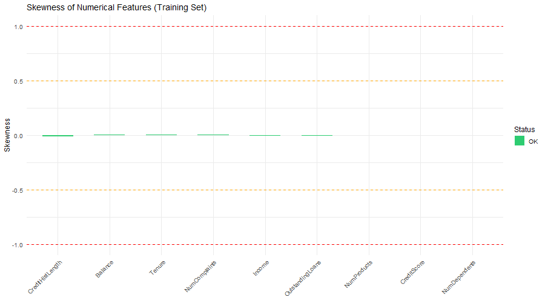

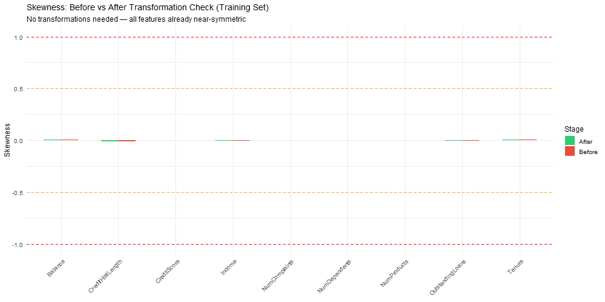

### Outliers

**Zero outliers detected** across all features using the IQR method (1.5 × IQR fence). All values fall within their natural bounded ranges.

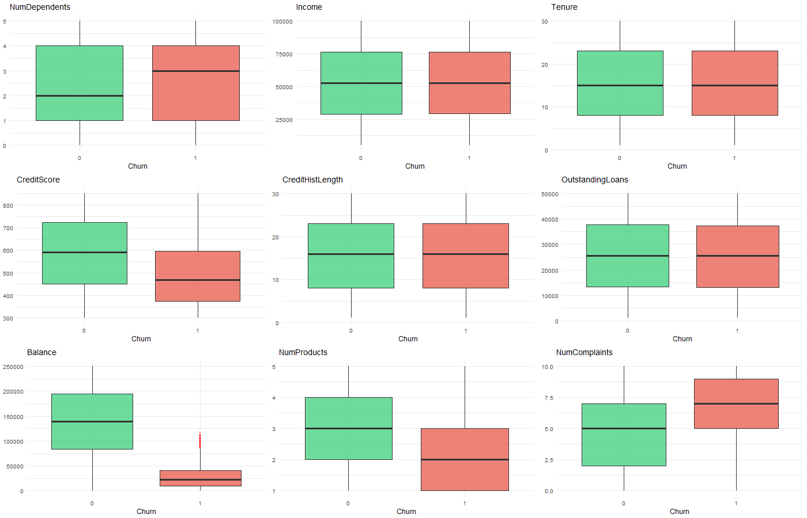

---

## 9. Key Takeaways

1. **Strongest predictors:** Balance (r = −0.50), NumComplaints (r = +0.21), CreditScore (r = −0.18), NumProducts (r = −0.18).
2. **Weak/no signal:** All categorical features and several numerical features (Income, Tenure, CreditHistLength, OutstandingLoans, NumDependents) show no meaningful relationship with churn.
3. **Class imbalance:** 7.2:1 ratio requires attention during modeling.
4. **No preprocessing needed:** No missing values, no outliers, no skewness to correct. The synthetic dataset is clean by construction.
5. **Modeling recommendation:** Focus on the 4 strong predictors. Consider class-weight balancing or SMOTE. Logistic regression and decision trees (as specified in the proposal) should perform well given the clear linear relationships.

---

## 10. Output Files

| File | Description |
|---|---|
| `data/train_data.csv` | Training set (92,513 rows, cleaned) |
| `data/test_data.csv` | Test set (23,127 rows, cleaned, untouched) |
| `1.EDA/eda.R` | Reproducible R script for all EDA steps |
| `1.EDA/*.png` | 12 visualization files |
