# Exploratory Data Analysis — Bank Customer Churn

## 1. Dataset Overview

**Source:** [Botswana Bank Customer Churn (Kaggle)](https://www.kaggle.com/datasets/sandiledesmondmfazi/bank-customer-churn)

- **Rows:** 115,640
- **Columns (raw):** 25
- **Columns (after cleaning):** 16 (15 features + target)
- **Missing values:** None
- **Duplicate rows:** None

### Age from date of birth

**Date.of.Birth** is parsed and converted to **Age** in whole years using a fixed reference date **2024-12-31** (floor of days since birth divided by 365.25). That keeps the feature reproducible across runs. On the full dataset, age ranges from **18** to **76** years (mean ≈ 46.9, median 47).

### Columns dropped (not kept as features)

| Column | Reason |
|--------|--------|
| RowNumber, CustomerId | Row identifiers |
| Surname, First.Name | Personal identifiers |
| Date.of.Birth | Replaced by derived **Age** |
| Address, Contact.Information | Free-text, not predictive |
| Occupation | 639 unique values — too high cardinality |
| Churn.Reason, Churn.Date | Post-churn leakage (only populated for churners) |

### Final feature set

| Feature | Type | Description |
|---------|------|-------------|
| Gender | Categorical (2) | Female, Male |
| MaritalStatus | Categorical (3) | Divorced, Married, Single |
| NumDependents | Numeric (0–5) | Number of dependents |
| **Age** | **Numeric (18–76)** | **Age in years (reference 2024-12-31)** |
| Income | Numeric | Annual income (5K–100K) |
| EducationLevel | Categorical (4) | Bachelor's, Diploma, High School, Master's |
| Tenure | Numeric (1–30) | Years as customer |
| CustomerSegment | Categorical (3) | Corporate, Retail, SME |
| CommChannel | Categorical (2) | Email, Phone |
| CreditScore | Numeric (300–850) | Credit score |
| CreditHistLength | Numeric (1–30) | Credit history length (years) |
| OutstandingLoans | Numeric | Outstanding loan amount |
| Balance | Numeric | Account balance |
| NumProducts | Numeric (1–5) | Number of bank products |
| NumComplaints | Numeric (0–10) | Number of complaints filed |
| **Churn** | **Target (0/1)** | **1 = churned, 0 = retained** |

---

## 2. Target distribution

The dataset is **imbalanced**: ~88% retained vs ~12% churned.

| Churn | Count | Percentage |
|-------|-------|------------|
| 0 (No Churn) | 101,546 | 87.81% |
| 1 (Churn) | 14,094 | 12.19% |

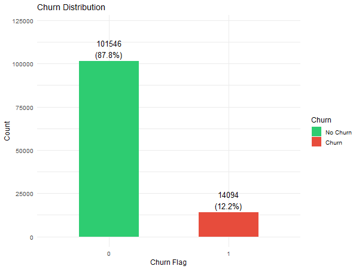

---

## 3. Categorical features vs churn

All categorical features show **virtually identical churn rates (~12.2%) across every level**. Gender, MaritalStatus, EducationLevel, CustomerSegment, and CommChannel have essentially no discriminative power for predicting churn.

| Feature | Levels | Churn rate range |
|---------|--------|------------------|
| Gender | Female, Male | 12.15%–12.23% |
| MaritalStatus | Divorced, Married, Single | 11.93%–12.47% |
| EducationLevel | 4 levels | 11.98%–12.33% |
| CustomerSegment | Corporate, Retail, SME | 12.10%–12.30% |
| CommChannel | Email, Phone | 12.19%–12.19% |

This is a consequence of the synthetic data generation — categorical features were sampled independently of churn.

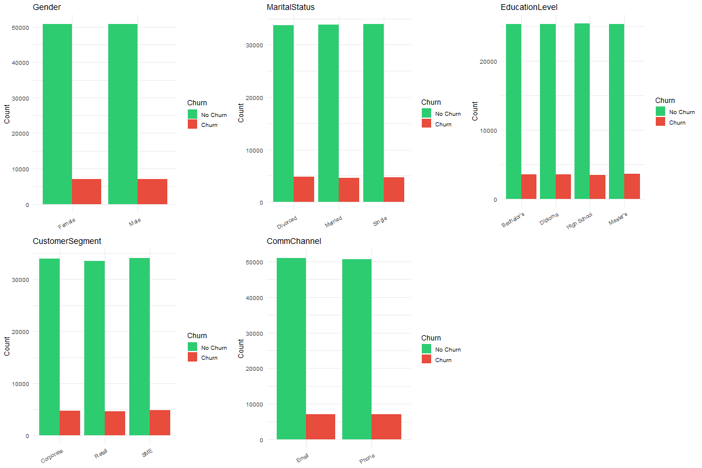

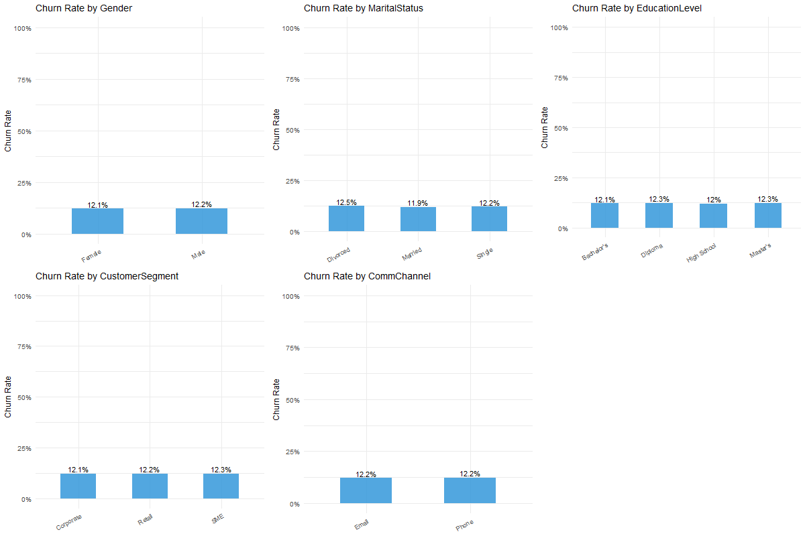

---

## 4. Numerical feature distributions

All numerical features (including **Age**) show **near-perfect symmetry** (|skewness| < 0.02 on the training set) and bounded ranges. Histograms and density plots include Age alongside the other numeric inputs. No outliers were detected by the IQR method.

This is consistent with synthetic data generated from uniform distributions.

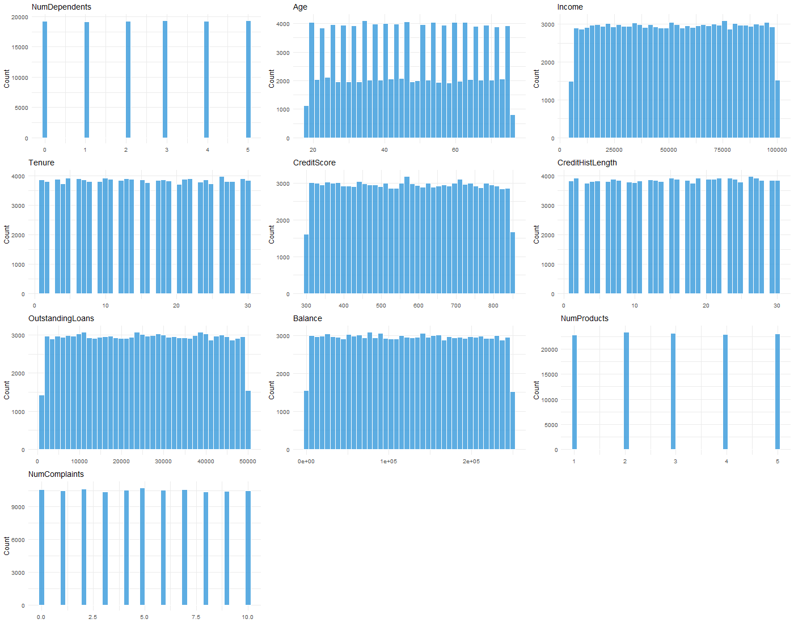

---

## 5. Features correlated with churn

Density plots and the correlation matrix include **Age**. Correlation with churn is negligible for Age (and for most other numerics except the four listed below).

| Feature | Correlation with churn | Interpretation |
|---------|------------------------|----------------|
| **Balance** | **−0.500** | Churners have drastically lower balances (~28K vs ~138K) |
| **NumComplaints** | **+0.205** | Churners file more complaints (avg 6.7 vs 4.8) |
| **CreditScore** | **−0.183** | Churners have lower credit scores (avg 496 vs 585) |
| **NumProducts** | **−0.179** | Churners use fewer products (avg 2.3 vs 3.1) |
| NumDependents | +0.003 | No signal |
| CreditHistLength | +0.003 | No signal |
| Income | +0.002 | No signal |
| Tenure | +0.000 | No signal |
| OutstandingLoans | −0.001 | No signal |
| **Age** | **−0.0024** | **No meaningful signal** |

**Balance is by far the strongest predictor**, followed by NumComplaints, CreditScore, and NumProducts. **Age** behaves like the other weak numerics: flat relationship with churn in this synthetic dataset.

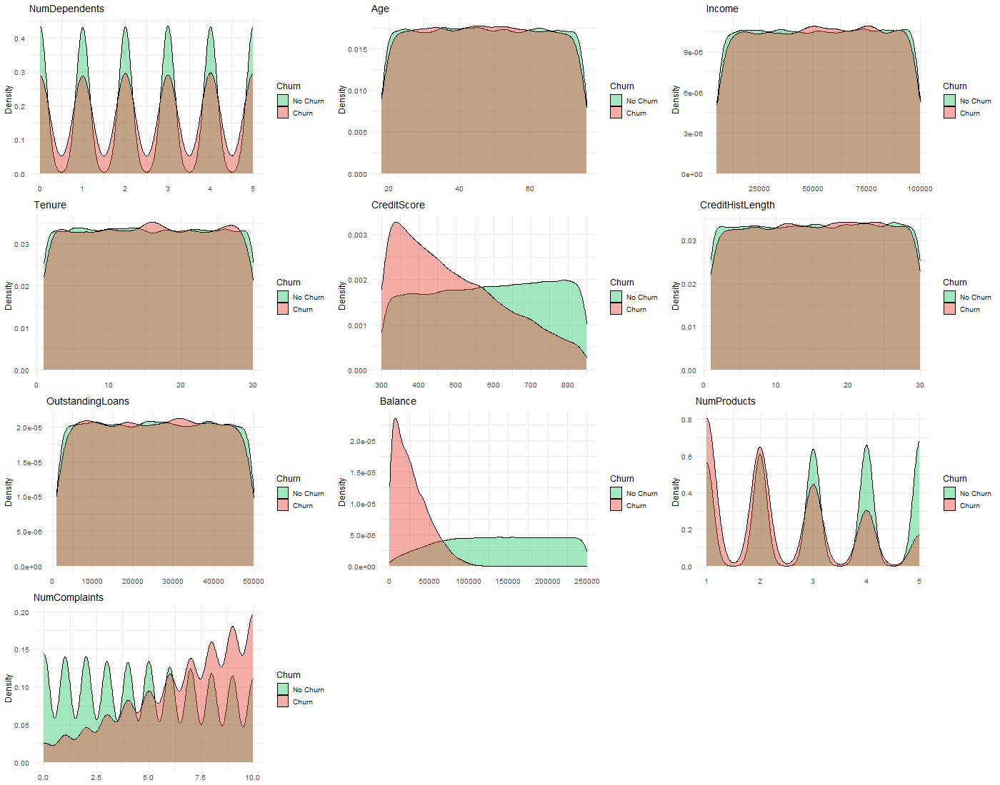

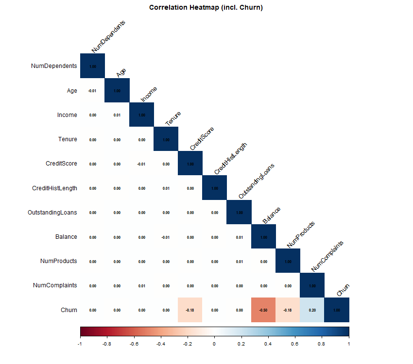

### Complaints vs churn (monotonic relationship)

Churn rate increases monotonically with complaint count:

| Complaints | Churn rate |
|------------|------------|
| 0 | 2.95% |
| 1 | 4.21% |
| 2 | 5.41% |
| 3 | 7.77% |
| 4 | 9.70% |
| 5 | 11.10% |
| 6 | 13.62% |
| 7 | 16.13% |
| 8 | 18.66% |
| 9 | 21.20% |
| 10 | 23.52% |

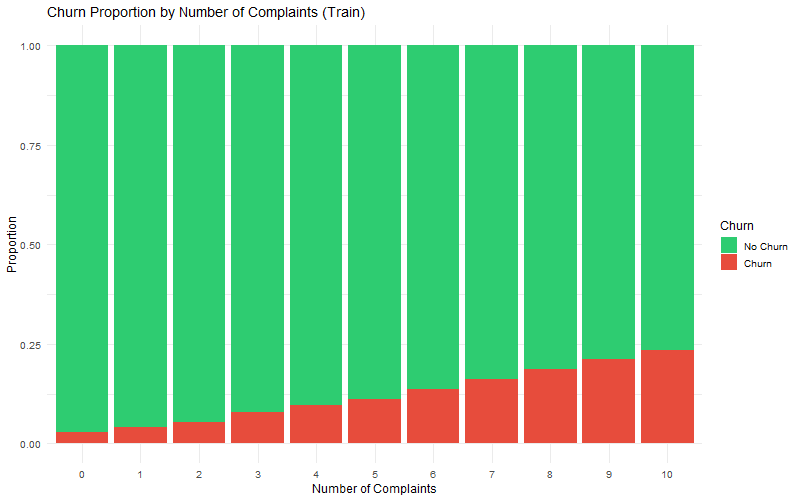

### Balance vs churn

Churners cluster heavily in the low-balance range:

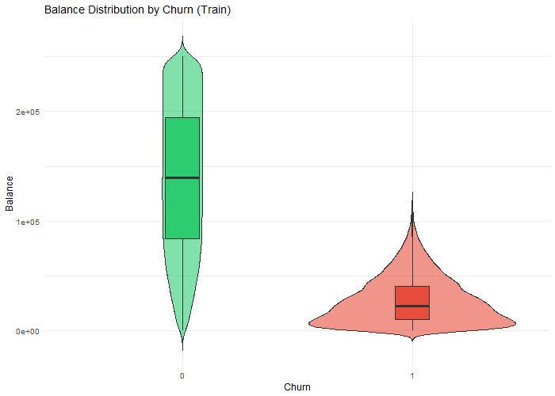

### Age vs churn

Distributions of Age by churn largely overlap (consistent with r ≈ 0):

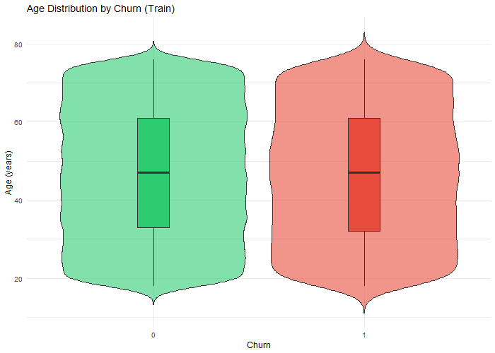

---

## 6. Train / test split

Stratified 80/20 split preserving churn ratio:

| Set | Rows | Churn % |
|-----|------|---------|
| Train | 92,513 | 12.19% |
| Test | 23,127 | 12.18% |

---

## 7. Training set — class imbalance

**Imbalance ratio: 7.2 : 1** (81,237 retained vs 11,276 churned).

This will require handling during modeling (class weights, SMOTE, or stratified sampling).

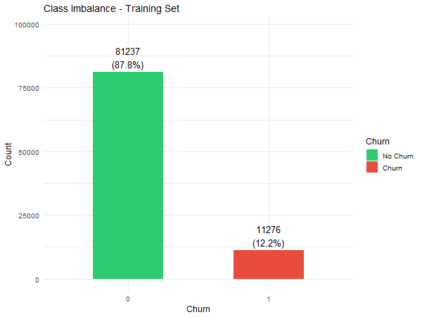

---

## 8. Training set — skewness and outliers

### Skewness

All features (including **Age**) have skewness extremely close to zero:

| Feature | Skewness | Kurtosis | Status |
|---------|----------|----------|--------|
| NumDependents | −0.0002 | −1.2682 | OK |
| Age | 0.0010 | −1.1926 | OK |
| Income | −0.0033 | −1.2016 | OK |
| Tenure | 0.0043 | −1.2026 | OK |
| CreditScore | 0.0010 | −1.2031 | OK |
| CreditHistLength | −0.0105 | −1.2014 | OK |
| OutstandingLoans | −0.0031 | −1.1969 | OK |
| Balance | 0.0077 | −1.1992 | OK |
| NumProducts | 0.0019 | −1.2946 | OK |
| NumComplaints | 0.0040 | −1.2160 | OK |

**No skewness corrections were applied.** All features are already near-perfectly symmetric. The negative kurtosis (~−1.2) confirms uniform-like distributions, consistent with synthetic data.

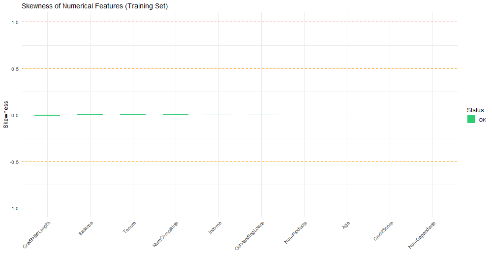

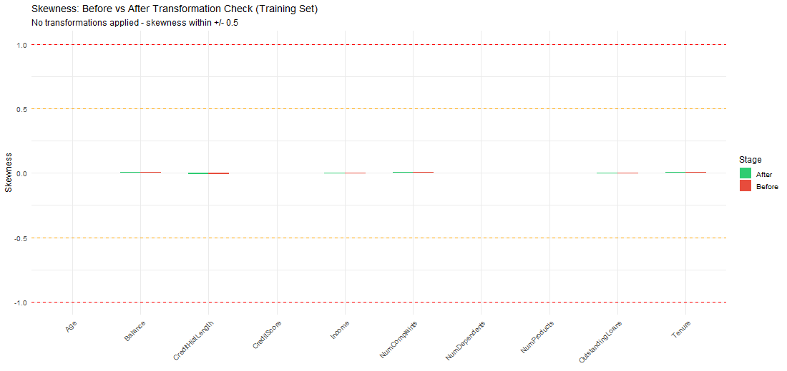

### Outliers

**Zero outliers detected** across all features (including Age) using the IQR method (1.5 × IQR fence). All values fall within their natural bounded ranges.

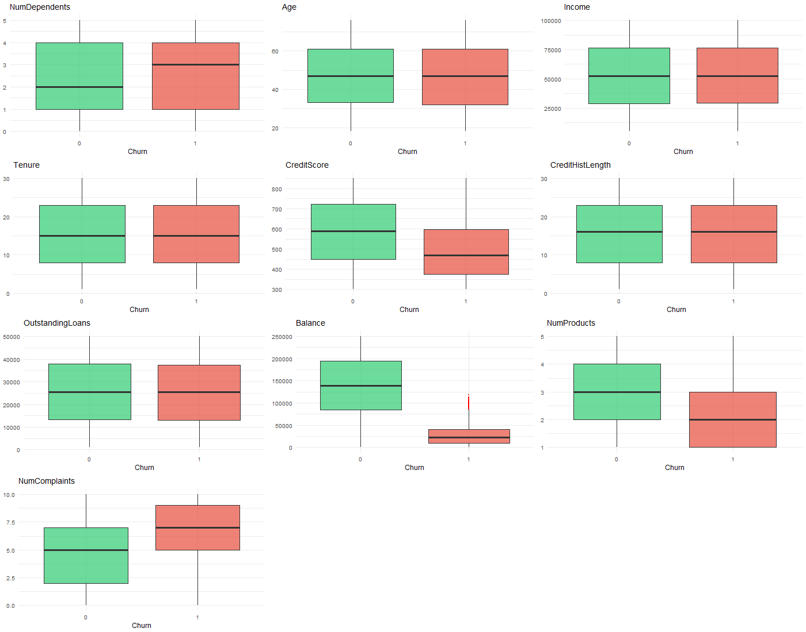

---

## 9. Key takeaways

1. **Strongest predictors:** Balance (r = −0.50), NumComplaints (r = +0.21), CreditScore (r = −0.18), NumProducts (r = −0.18).
2. **Age:** Derived from Date.of.Birth with a fixed reference date; included in the full numeric EDA pipeline. Correlation with churn is negligible (r ≈ −0.0024), similar to Income and Tenure.
3. **Weak / no signal:** All categorical features and several numerical features (including Age, Income, Tenure, CreditHistLength, OutstandingLoans, NumDependents) show no meaningful relationship with churn.
4. **Class imbalance:** 7.2:1 ratio requires attention during modeling.
5. **No preprocessing needed:** No missing values, no outliers, no skewness to correct. The synthetic dataset is clean by construction.
6. **Modeling recommendation:** Focus on the four strong predictors. Consider class-weight balancing or SMOTE. Logistic regression and decision trees (as specified in the proposal) should perform well given the clear relationships for Balance and complaints.

---
