# Bank Customer Churn Prediction

*Identifying drivers of attrition in a retail bank*

**Group 6 - April 2026**

---

## Slide 1 - Title

> Purpose: introduce the project, the team, and the business problem.

**On-slide content**
- Title: "Bank Customer Churn Prediction"
- Subtitle: "Identifying drivers of attrition in a retail bank"
- Group 6 - April 2026

**Data**

| Name                   | Primary Responsibility                          |
| ---------------------- | ----------------------------------------------- |
| Virat Kumar            | EDA lead, feature engineering                   |
| Chamudhrikha Ravikumar | Logistic regression, feature importance         |
| Jennia Paul            | Business insights, visuals                      |
| Mi Dinh                | Decision tree, random forest, final report lead |

**Speaker notes**
Good morning. We are Group 6, and today we walk you through a churn-prediction project on a retail banking dataset. Customer attrition is expensive because acquiring a new customer costs several times more than keeping an existing one, so our goal was to find the customers most likely to leave before they do. Each of us owned a slice of the pipeline - EDA and feature engineering, logistic regression, tree-based models, and the final business translation. I will hand off between sections as we go.

---

## Slide 2 - Agenda

> Purpose: give the audience a 30-second roadmap of the talk.

**On-slide content**
- Problem
- Data
- Preprocessing
- EDA
- Modeling
- Feature importance
- Business insights
- Conclusion

**Speaker notes**
Here is the flow for the next few minutes. We start from the business problem, describe the dataset and how we cleaned it, walk through the exploratory findings that shaped modeling, compare three classifiers, rank the features the winning model relies on, and close with four concrete actions the retention team can take on Monday morning.

---

## Slide 3 - Project Objectives

> Purpose: state exactly what we set out to do.

**On-slide content**
- Identify key factors influencing a customer's decision to leave the bank.
- Build a classification model that predicts churn (0 = stays, 1 = leaves).
- Turn findings into concrete retention strategies that the business can execute.

**Speaker notes**
Our three objectives come straight from the proposal. First, diagnose: which customer attributes actually move the needle on attrition. Second, predict: build a model that flags likely churners on held-out data. Third, prescribe: turn the model's signal into levers the retention team can pull. The motivation is simple - keeping a customer is far cheaper than replacing one, so even a small lift on early detection pays for itself.

---

## Slide 4 - Dataset Overview

> Purpose: anchor everyone on what data we used.

**On-slide content**
- Botswana Bank Customer Churn dataset (Kaggle, synthetic).
- Designed to simulate realistic retail-bank customer behavior.
- Clean to start with: no missing values, no duplicates.

**Data**

| Property                 | Value                               |
| ------------------------ | ----------------------------------- |
| Rows                     | 115,640                             |
| Columns (raw)            | 25                                  |
| Columns (after cleaning) | 16 (15 features + target)           |
| Missing values           | 0                                   |
| Duplicate rows           | 0                                   |
| Target                   | `Churn` (0 = retained, 1 = churned) |
| Churn rate               | 12.19%                              |

**Speaker notes**
We worked on the Botswana Bank Customer Churn dataset from Kaggle. It is synthetic, which is a caveat we will come back to, but the schema mirrors a real retail bank. We started with 115,640 rows and 25 columns. There were no missing values and no duplicate rows, so the heavy lifting was not imputation - it was deciding which columns to keep and which to drop.

---

## Slide 5 - Data Preprocessing Pipeline

> Purpose: show the cleaning and leakage-removal flow end-to-end.

**On-slide content**

```text
Raw CSV (25 cols)
   | drop IDs / PII: RowNumber, CustomerId, Surname, First.Name, Address, Contact.Information
   | drop high-cardinality / leakage: Occupation (639 levels), Churn.Reason, Churn.Date
   | derive Age from Date.of.Birth (reference 2024-12-31)
   v
Clean analytical table (16 cols)
   | stratified 80 / 20 split (seed 42)
   v
train_data.csv  (92,513 rows)    test_data.csv (23,127 rows)
```

**Data**

| Column                       | Reason                                   |
| ---------------------------- | ---------------------------------------- |
| RowNumber, CustomerId        | Row identifiers                          |
| Surname, First.Name          | PII                                      |
| Date.of.Birth                | Replaced by derived `Age`                |
| Address, Contact.Information | Free-text, not predictive                |
| Occupation                   | 639 unique values (too high cardinality) |
| Churn.Reason, Churn.Date     | Post-churn leakage                       |

**Speaker notes**
Preprocessing was mostly disciplined column removal. We dropped identifiers and PII because they cannot generalize. We dropped `Occupation` because 639 free-text levels would drown any model. Most importantly, we dropped `Churn.Reason` and `Churn.Date` - those are only populated after a customer has already churned, so leaving them in would have been target leakage. We then derived `Age` from `Date.of.Birth` using 2024-12-31 as the reference, ending on a 16-column analytical table that we split 80/20 with stratification and seed 42.

---

## Slide 6 - Final Feature Set (15 features + target)

> Purpose: catalog every predictor that enters the models.

**On-slide content**
- 15 predictors grouped into demographic, financial, relationship, behavioral, and service categories.
- Four bolded rows preview the levers EDA will validate.

**Data**

| Feature          | Type              | Range / Levels                             | Role         |
| ---------------- | ----------------- | ------------------------------------------ | ------------ |
| Gender           | Categorical (2)   | Female, Male                               | Demographic  |
| MaritalStatus    | Categorical (3)   | Divorced, Married, Single                  | Demographic  |
| NumDependents    | Numeric           | 0-5                                        | Demographic  |
| Age              | Numeric (derived) | 18-76                                      | Demographic  |
| Income           | Numeric           | 5K-100K                                    | Financial    |
| EducationLevel   | Categorical (4)   | Bachelor's, Diploma, High School, Master's | Demographic  |
| Tenure           | Numeric           | 1-30 yrs                                   | Relationship |
| CustomerSegment  | Categorical (3)   | Corporate, Retail, SME                     | Business     |
| CommChannel      | Categorical (2)   | Email, Phone                               | Behavioral   |
| **CreditScore**  | **Numeric**       | **300-850**                                | **Financial**    |
| CreditHistLength | Numeric           | 1-30 yrs                                   | Financial    |
| OutstandingLoans | Numeric           | -                                          | Financial    |
| **Balance**      | **Numeric**       | **-**                                      | **Financial**    |
| **NumProducts** | **Numeric**       | **1-5**                                    | **Engagement**   |
| **NumComplaints** | **Numeric**     | **0-10**                                   | **Service**      |
| **Churn**        | **Binary**        | **0 / 1**                                  | **Target**   |

**Speaker notes**
This is the full feature set the models actually see. The bolded rows - Balance, NumComplaints, CreditScore, NumProducts - are the ones EDA will confirm as the real drivers. Everything else is included for fairness but turns out to carry almost no univariate signal.

---

## Slide 7 - Target Distribution & Class Imbalance

> Purpose: quantify how imbalanced the label is and why that changes our evaluation.

**On-slide content**
- 87.81% retained vs 12.19% churned.
- Imbalance ratio roughly 7.2 : 1 on the training split.
- Accuracy alone is misleading - we also track AUC and the confusion matrix.

**Data**

| Class        | Count   | %      |
| ------------ | ------- | ------ |
| 0 - Retained | 101,546 | 87.81% |
| 1 - Churned  | 14,094  | 12.19% |

**Visuals**


**Speaker notes**
The target is imbalanced: about one in eight customers churns. A naive "everyone stays" classifier already scores 87.8% accuracy, so we cannot rely on accuracy alone. For this reason we read AUC and the confusion matrix alongside accuracy when comparing models, and we keep an eye on sensitivity since missing a churner is the expensive error.

---

## Slide 8 - EDA: Categorical Features - no signal

> Purpose: rule out the categorical variables as drivers.

**On-slide content**
- Churn rate is essentially flat across every level of every categorical feature.
- Consistent with the dataset's synthetic origin - categorical noise.

**Data**

| Feature         | Levels | Churn rate range |
| --------------- | ------ | ---------------- |
| Gender          | 2      | 12.15% - 12.23%  |
| MaritalStatus   | 3      | 11.93% - 12.47%  |
| EducationLevel  | 4      | 11.98% - 12.33%  |
| CustomerSegment | 3      | 12.10% - 12.30%  |
| CommChannel     | 2      | 12.19% - 12.19%  |

**Visuals**


**Speaker notes**
We start by clearing out the categorical variables. None of them moves churn by more than a few tenths of a percentage point between levels - Gender, Marital Status, Education, Customer Segment, Communication Channel all hover right around the 12.19% base rate. That is partly because the data is synthetic, and partly because churn is driven by what customers do, not who they are on paper.

---

## Slide 9 - EDA: Numerical Distributions

> Purpose: confirm the numerics are clean and need no transforms.

**On-slide content**
- All 10 numerics are near-symmetric (|skew| < 0.02).
- Zero outliers by the 1.5 x IQR rule across every feature.
- No imputation, no log / Box-Cox transforms needed.

**Data**

| Feature       | Skewness | Kurtosis |
| ------------- | -------- | -------- |
| Age           | 0.001    | -1.19    |
| Income        | -0.003   | -1.20    |
| Balance       | 0.008    | -1.20    |
| CreditScore   | 0.001    | -1.20    |
| NumComplaints | 0.004    | -1.22    |

**Visuals**


**Speaker notes**
The numerics tell the same clean story: almost perfectly symmetric with skewness near zero, flat-topped kurtosis consistent with uniform-ish generators, and no outliers by the 1.5 x IQR rule. In a real project we would usually need winsorization or log transforms; here we do not. That means the models see raw, unscaled numerics, and whatever signal they find is real rather than an artifact of a long tail.

---

## Slide 10 - EDA: Correlation with Churn

> Purpose: surface the four numeric features that actually move churn.

**On-slide content**
- Only four features correlate meaningfully with churn.
- Balance is by far the strongest single signal (negative).
- Complaints are the only strong positive signal.

**Data**

| Feature           | r with Churn | Signal    |
| ----------------- | ------------ | --------- |
| **Balance**       | **-0.500**   | Strongest |
| **NumComplaints** | **+0.205**   | Strong    |
| **CreditScore**   | **-0.183**   | Moderate  |
| **NumProducts**   | **-0.179**   | Moderate  |
| Age               | -0.002       | None      |
| Income            | +0.002       | None      |
| Tenure            | 0.000        | None      |
| OutstandingLoans  | -0.001       | None      |

**Visuals**


**Speaker notes**
This is the slide the whole story hinges on. Four features - Balance, NumComplaints, CreditScore, NumProducts - account for essentially all the univariate signal. Balance shows a strong negative correlation of -0.50: the lower the balance, the more likely the customer is to leave. Complaints is the only strong positive: more complaints, more churn. Everything else - Age, Income, Tenure, Outstanding Loans - is statistical noise on this dataset.

---

## Slide 11 - EDA Deep-Dive: Complaints & Balance

> Purpose: zoom into the two most actionable drivers.

**On-slide content**
- Complaints have a clean monotone effect: every extra complaint raises churn probability.
- Churners carry roughly 28K in balance vs ~138K for retained customers.
- These are operational levers, not just statistical artifacts.

**Data**

| Complaints | Churn rate |
| ---------- | ---------- |
| 0          | 2.95%      |
| 2          | 5.41%      |
| 4          | 9.70%      |
| 6          | 13.62%     |
| 8          | 18.66%     |
| 10         | 23.52%     |

**Visuals**


**Speaker notes**
Zooming into the two strongest drivers. Complaints escalate churn in a near-linear, monotone fashion - a customer with zero complaints churns at 3%, a customer with ten complaints churns at 24%. That is eight times the baseline. Balance tells a complementary story: customers who leave carry on average around 28,000 in balance, while customers who stay carry almost five times that. For contrast, the Age violin shows no separation at all - a reminder that demographics are not where the action is.

---

## Slide 12 - Methodology: Train/Test & Model Plan

> Purpose: lock in the evaluation protocol and the three candidates.

**On-slide content**
- Stratified 80/20 split, seed 42, decision threshold 0.5.
- Metrics: test accuracy (headline) + AUC + confusion matrix.
- Three models, one champion selected by test accuracy on an identical holdout.

**Data**

| Set   | Rows   | Churn % |
| ----- | ------ | ------- |
| Train | 92,513 | 12.19%  |
| Test  | 23,127 | 12.18%  |

```text
train_data.csv --> Ridge Logistic (glmnet, alpha=0, lambda.min via 5-fold CV)
              --> Decision Tree (rpart, cp from plotcp)
              --> Random Forest (ntree=250, mtry=4, nodesize=80)
                         |
                         v
               test_data.csv -> Accuracy / AUC / Confusion matrix
                         |
                         v
                     Winner -> Feature importance
```

**Speaker notes**
The evaluation protocol is simple and held constant across all three models. Same 80/20 stratified split, same random seed, same 0.5 decision threshold, same holdout set. We report test accuracy as the headline, backed by AUC and the confusion matrix. We had to use ridge logistic rather than plain glm because plain glm suffered from quasi-complete separation on this data; ridge fixes that while keeping the logit model interpretable.

---

## Slide 13 - Model 1: Ridge Logistic Regression

> Purpose: establish an interpretable linear baseline.

**On-slide content**
- Penalized logistic regression fitted with `glmnet`, alpha = 0.
- Regularization strength picked by 5-fold CV on training AUC.
- Strong baseline, but left on the table by the non-linear models.

**Data**

| Item              | Value                         |
| ----------------- | ----------------------------- |
| Package           | `glmnet`                      |
| alpha             | 0 (ridge / L2)                |
| lambda selection  | 5-fold CV, `lambda.min` (AUC) |
| Threshold         | 0.5                           |
| **Test accuracy** | **95.20%**                    |

**Visuals**
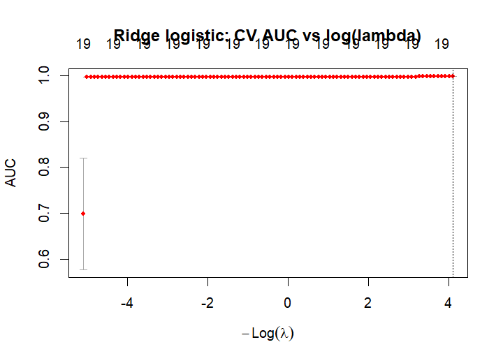
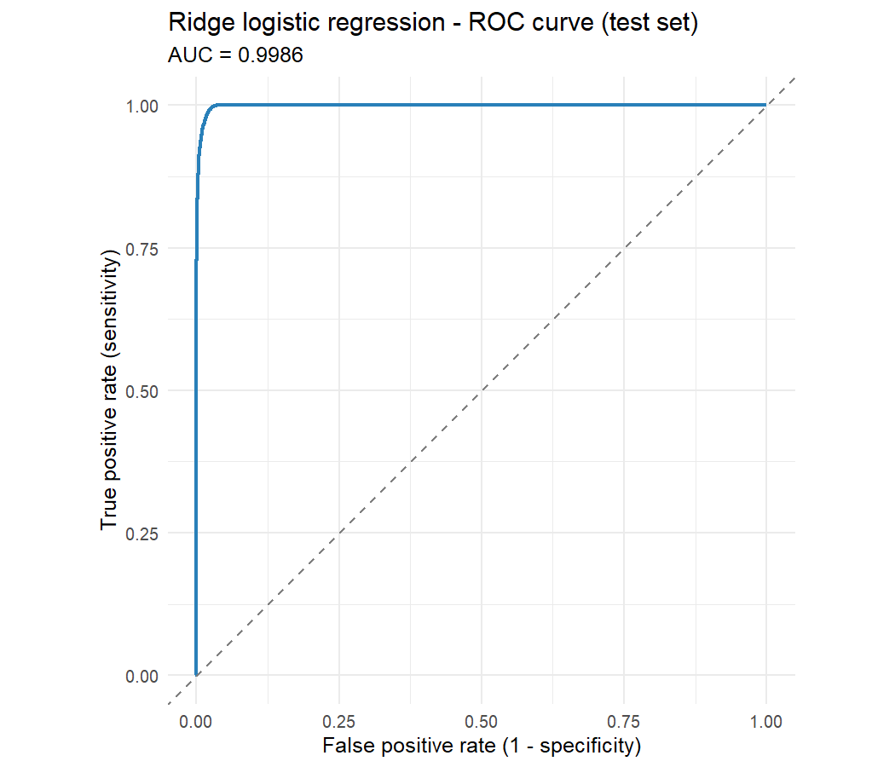
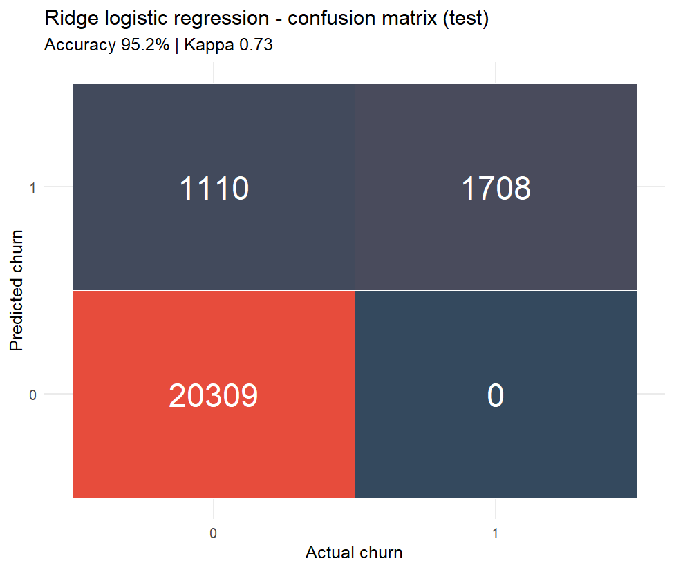
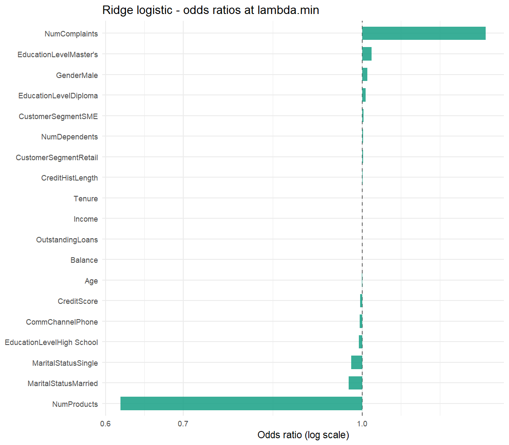

**Speaker notes**
Our linear baseline is a ridge logistic regression fit with glmnet. Ridge was necessary because a plain glm ran into quasi-complete separation - some feature combinations perfectly predict churn on this synthetic data - and the L2 penalty stabilizes the coefficients. We chose lambda by 5-fold cross-validation on AUC and used the lambda.min value. The resulting model scores 95.20% test accuracy, respectable but clearly below the trees. Odds ratios are still interpretable, shrunk but in the expected direction for Balance and NumComplaints.

---

## Slide 14 - Model 2: Decision Tree (rpart)

> Purpose: present the champion model in its simplest, most interpretable form.

**On-slide content**
- CART-style tree via `rpart`, pruned using the minimum xerror from `plotcp`.
- Readable splits map directly onto business language.
- Top test accuracy of the three.

**Data**

| Item              | Value                    |
| ----------------- | ------------------------ |
| Package           | `rpart`                  |
| Split criterion   | Information gain         |
| CP selection      | min xerror from `plotcp` |
| Threshold         | 0.5                      |
| **Test accuracy** | **98.39%**               |

**Visuals**
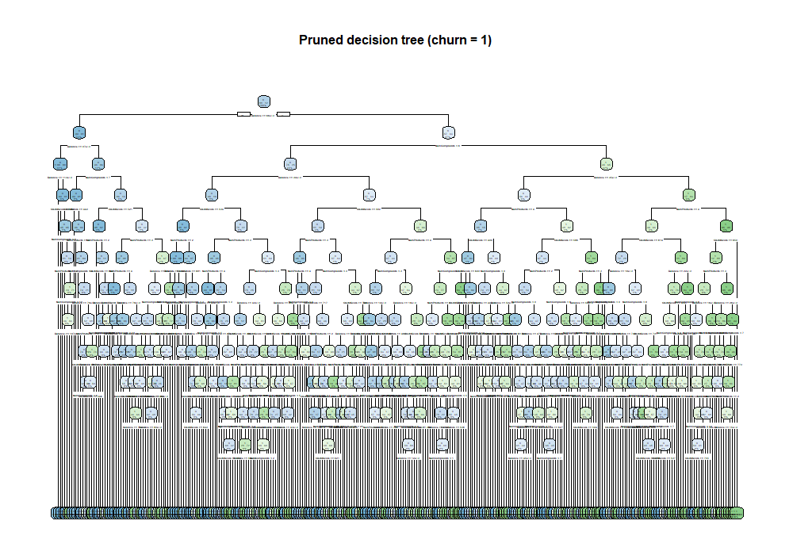
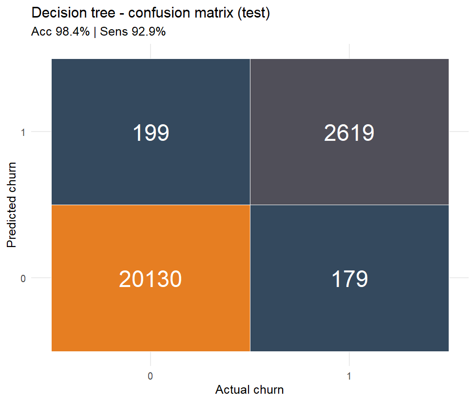
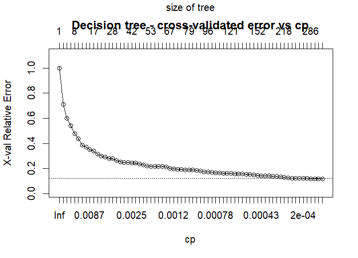

**Speaker notes**
The decision tree is the surprise winner. We fit it with rpart on information gain, then pruned at the complexity parameter that minimized the cross-validated error in plotcp. The resulting tree is small enough to read on one slide and scores 98.39% test accuracy. When you trace a path - for example "Balance low, NumComplaints high" - the leaf predicts churn, which is exactly what EDA told us to expect. The tree is not only accurate, it is also the easiest model to explain to a retention manager.

---

## Slide 15 - Model 3: Random Forest

> Purpose: confirm the tree's signal with an ensemble and quantify variable importance.

**On-slide content**
- 250 trees, mtry = 4, nodesize = 80.
- Nearly ties the single tree on accuracy - diminishing returns from bagging here.
- Its variable importance ranking matches the single tree, which validates the signal.

**Data**

| Item              | Value          |
| ----------------- | -------------- |
| Package           | `randomForest` |
| ntree             | 250            |
| mtry              | 4              |
| nodesize          | 80             |
| Threshold         | 0.5            |
| **Test accuracy** | **98.15%**     |

**Visuals**
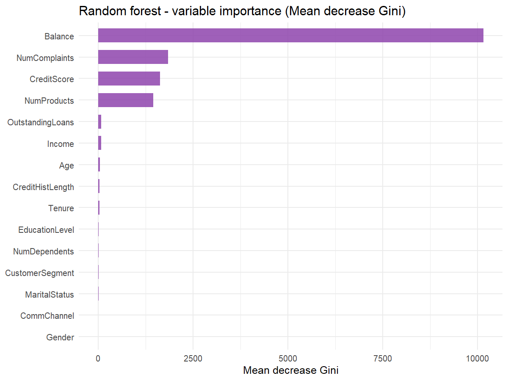
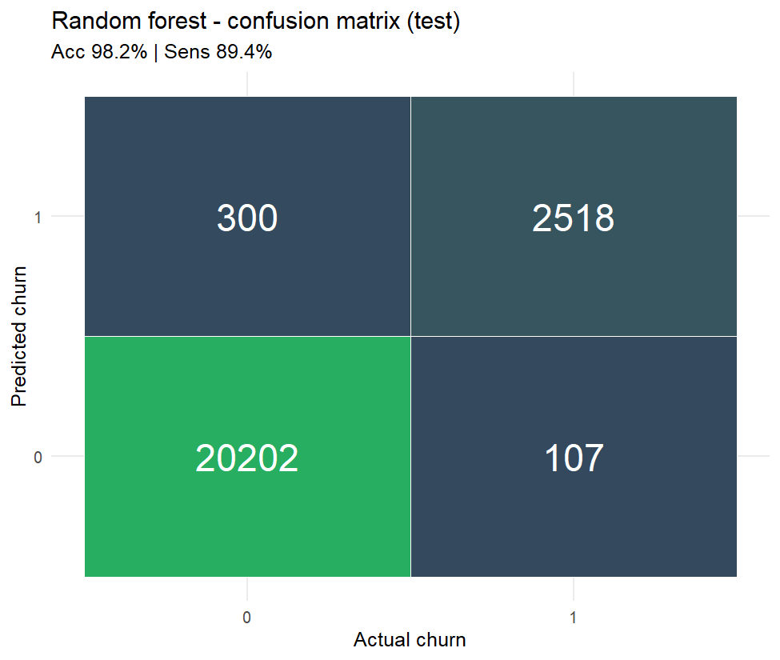

**Speaker notes**
The random forest is mainly a sanity check on the tree. We grew 250 trees with mtry = 4 and a minimum node size of 80 to keep it well-regularized. It lands at 98.15% test accuracy, a hair below the single tree, which tells us bagging is adding very little on this dataset. More importantly, its variable importance ranking agrees with the single tree: the same four features dominate, so the signal is not an artifact of one particular tree shape.

---

## Slide 16 - Model Comparison & Winner

> Purpose: pick the champion and justify the choice.

**On-slide content**
- Decision Tree wins on accuracy and on interpretability - a rare but welcome combination.
- All three models beat the 87.81% "majority class" baseline by a wide margin.
- We carry the Decision Tree forward for feature importance.

**Data**

| Model             | Test Accuracy       |
| ----------------- | ------------------- |
| Ridge Logistic    | 95.20%              |
| **Decision Tree** | **98.39% - WINNER** |
| Random Forest     | 98.15%              |

**Visuals**
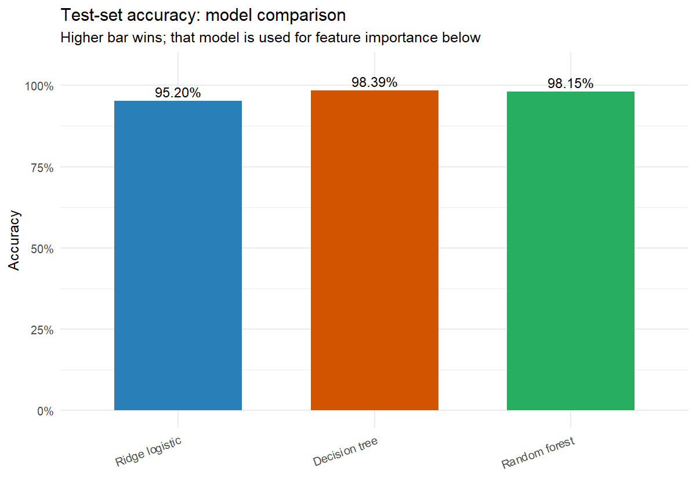
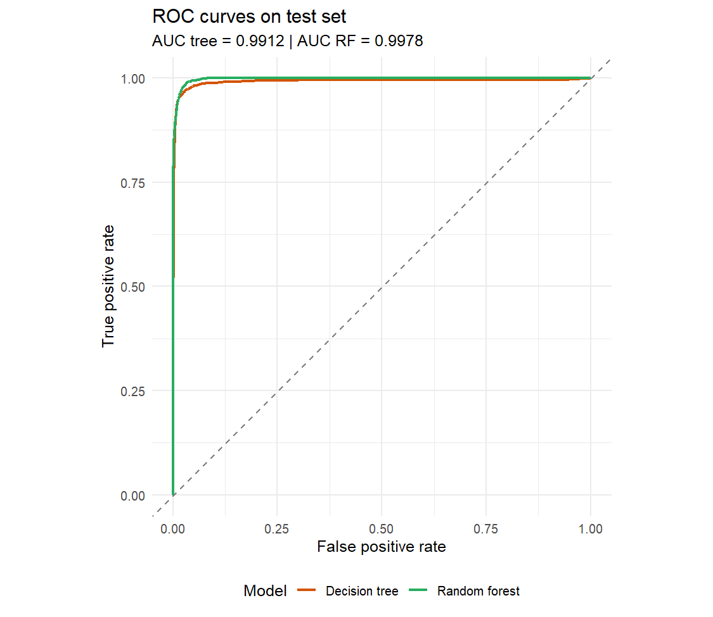

**Speaker notes**
Head-to-head, the Decision Tree wins both on accuracy - 98.39% vs 98.15% for the forest and 95.20% for ridge logistic - and on interpretability, because a manager can read the splits directly. All three models crush the 87.81% majority-class baseline, so the lift is real. We carry the tree forward as our champion, which means the feature importance you see on the next slide is the tree's.

---

## Slide 17 - Feature Importance (Winner model)

> Purpose: translate model internals into a short, actionable watchlist.

**On-slide content**
- Winner (Decision Tree) importance aligns with EDA: Balance, NumComplaints, CreditScore, NumProducts dominate impurity reduction.
- Cumulative chart: the top handful of features explain almost all the signal.
- Importance is model-relative, not causal - pair it with the EDA correlations from slide 10.

**Data**

| Rank | Feature          | Role              |
| ---- | ---------------- | ----------------- |
| 1    | Balance          | Financial - lever |
| 2    | NumComplaints    | Service - lever   |
| 3    | CreditScore      | Financial         |
| 4    | NumProducts      | Engagement        |

**Visuals**
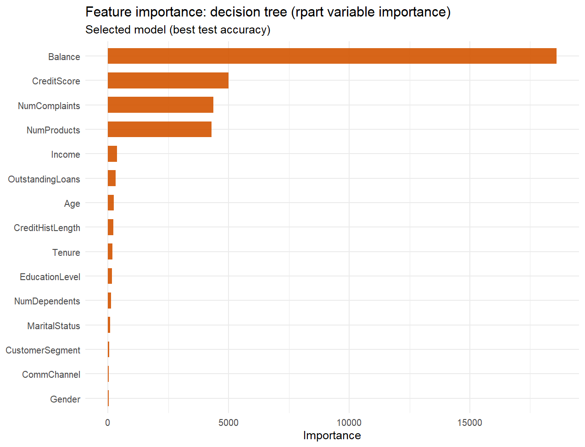
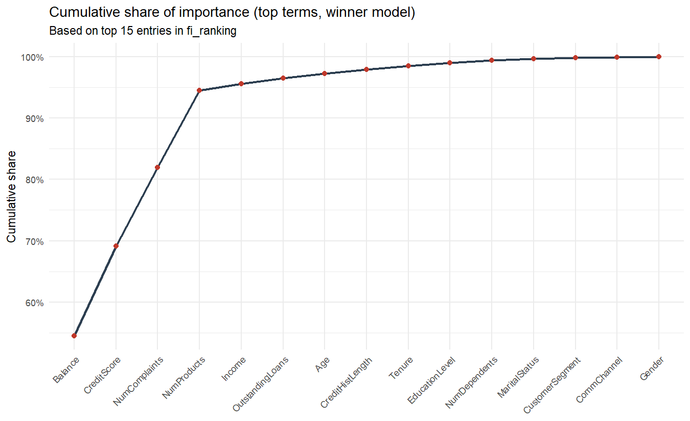

**Speaker notes**
The tree's feature importance is a direct echo of the EDA on slide 10: Balance first, NumComplaints second, then Credit Score and NumProducts. The cumulative chart is the punchline - the top few features explain nearly all the signal, so the retention team does not need to monitor fifteen columns, they need to monitor four. One caveat: importance here is model-relative, not causal, which is why we always read it next to the raw correlations.

---

## Slide 18 - Business Insights, Conclusion & Story Recap

> Purpose: turn the model into four concrete retention actions and close the story.

**On-slide content**
1. **Complaint SLA & quality monitoring** - every complaint band up is a measurable step-up in churn, so tighten resolution SLAs and escalate repeat complainers.
2. **Low-balance safety net** - liquidity support, fee waivers, or proactive outreach for accounts drifting into the low-balance, at-risk zone.
3. **Cross-sell & onboarding** - lift `NumProducts` to deepen relationships, because multi-product customers churn less.
4. **Cost-aware threshold & monitoring** - tune the decision threshold away from 0.5 where FN cost > FP, and retrain periodically to catch drift.

**One-line story recap:** problem -> clean 16-column table -> 4 predictors -> 3 models -> Decision Tree at 98.39% -> act on complaints and balance.

**Visuals**
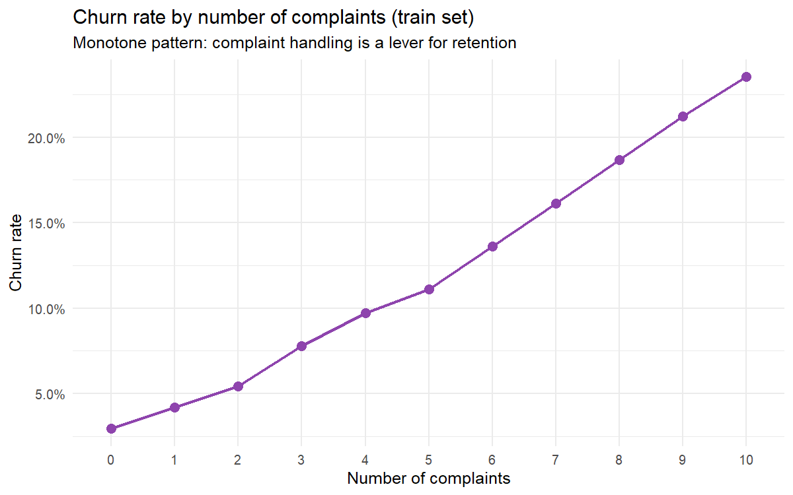
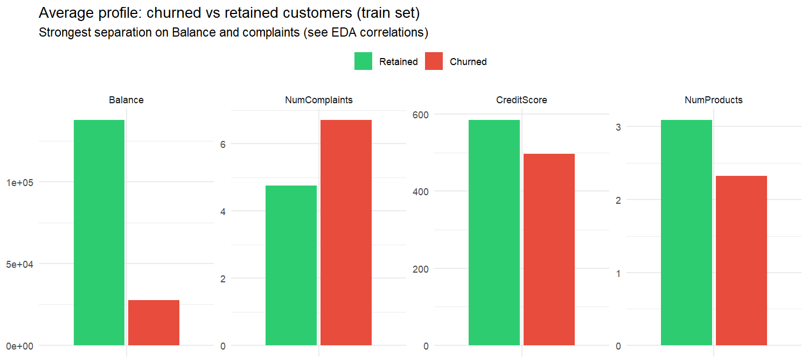

**Speaker notes**
We leave the business with four actions. First, complaints are a direct operational lever - every extra complaint raises churn measurably, so tightening SLAs and escalating repeat complainers is the single biggest near-term win. Second, a low-balance safety net: liquidity support or fee waivers for accounts drifting toward the at-risk profile. Third, deepen relationships through cross-sell - multi-product customers are stickier. Fourth, tune the decision threshold to the actual cost of a missed churner rather than the default 0.5, and refresh the model on a schedule to catch drift. The one caveat we want to leave you with is that the dataset is synthetic, so real banking data will bring noise, seasonality, and compliance constraints - but the framework we have built transfers cleanly. Thank you - happy to take questions.

---

## Story Rundown

The business problem is customer attrition at a retail bank, where keeping an existing customer is far cheaper than acquiring a new one. We used the Botswana Bank Customer Churn dataset from Kaggle - 115,640 rows, 25 raw columns, synthetic but clean. Preprocessing removed identifiers and PII, dropped the 639-level Occupation column, eliminated `Churn.Reason` and `Churn.Date` to prevent leakage, and derived `Age` from `Date.of.Birth`, leaving 15 predictors plus a binary target. The split was stratified 80/20 with seed 42, preserving the 12.19% churn rate.

EDA cleared the categoricals - churn rates were essentially flat across Gender, Marital Status, Education, Customer Segment, and Communication Channel - and highlighted four numeric drivers: Balance (r = -0.50), NumComplaints (+0.21), CreditScore (-0.18), and NumProducts (-0.18). Complaints increased churn monotonically from 3% at zero complaints to 24% at ten.

We ran a bake-off between a ridge logistic regression (95.20%), a random forest (98.15%), and a pruned decision tree, which won at 98.39% test accuracy while also being the most interpretable. Its feature importance matched EDA, so the retention team can focus on four levers - complaint handling, low-balance safety nets, cross-sell, and cost-aware thresholds - with the caveat that the underlying data is synthetic.
